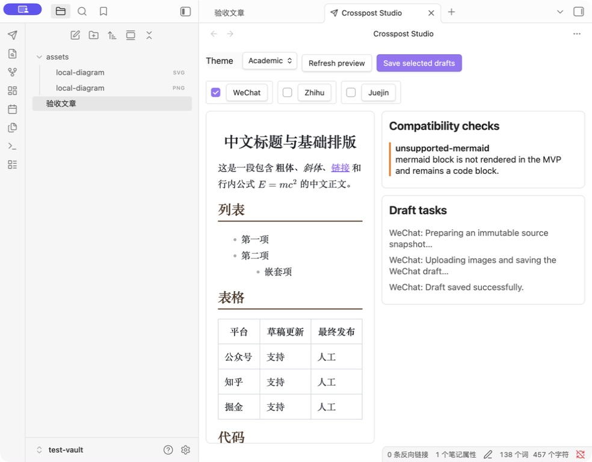
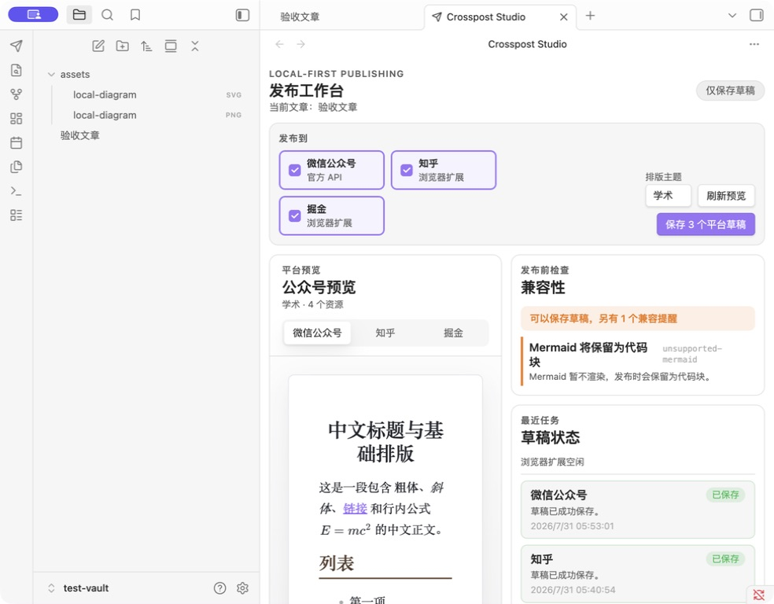

# Crosspost Studio 发布体验审视

## 范围

- Obsidian 发布工作台：选择平台、切换预览、兼容性检查、草稿状态。
- Chromium 扩展：配对、连接状态和按需平台权限。

## 现状

1. 平台复选框和预览按钮被放在同一控件里，选择发布目标与切换预览的含义不清晰。
2. 预览没有平台标题、主题与资源数量，难以确认当前看到的输出属于哪个平台。
3. 兼容性信息直接展示内部代码与英文信息，缺少“是否可以继续”的结论。
4. 草稿任务按事件追加日志，重复发布后不易快速判断每个平台的最终状态。
5. 当前焦点停在 Crosspost Studio 时，重载后可能无法恢复来源笔记。

## 改造结果

1. 发布目标改为独立平台卡片，主按钮实时显示将保存的平台数量。
2. 平台预览使用单独的标签页，显示平台、主题和资源数量。
3. 兼容性面板先给出可继续、提醒或阻塞结论，再展示可操作的详细信息。
4. 每个平台只有一张状态卡，任务进度会原位更新，并保留失败重试和未知结果解锁。
5. 工作台会从已打开或最近访问的 Markdown 叶子恢复来源文章。
6. Chromium 扩展新增已配对状态、实时连接时间、重新连接，以及知乎和掘金的实际权限状态。

## 验证限制

- Obsidian 改造前后均在同一测试 Vault、同一窗口尺寸下截图并检查。
- Chromium 的本地扩展页被当前浏览器安全策略阻止截图，因此扩展完成了类型检查、构建和产物审计，但没有在本次运行中形成视觉截图证据。
- 所有平台行为仍止于创建或更新草稿，不执行最终发布。
