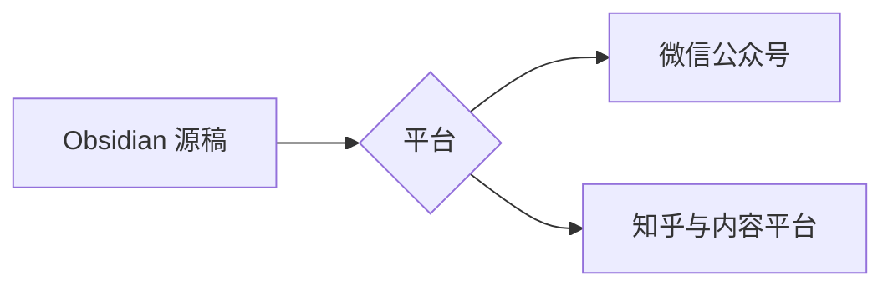

---
crosspost:
  title: Crosspost Studio 验收文章
  author: 测试作者
  summary: 包含 MVP 所需内容类型的草稿验收文章。
  cover: "[[assets/local-diagram.png]]"
  targets:
    - wechat
    - zhihu
    - juejin
  bindings:
    csdn:
      draftUrl: https://editor.csdn.net/md?articleId=163383800
      sourceHash: 0b234a0c0565684b9e537b8125de4c932d5faea521dd054534e1f2f31a7fced1
      updatedAt: 2026-08-10T15:19:05.455Z
    oschina:
      draftUrl: https://my.oschina.net/u/9762237/blog/ai-write/draft/3300943
      sourceHash: 0b234a0c0565684b9e537b8125de4c932d5faea521dd054534e1f2f31a7fced1
      updatedAt: 2026-08-10T11:03:39.093Z
    51cto:
      draftUrl: https://blog.51cto.com/blogger/draft/2068946
      sourceHash: 0b234a0c0565684b9e537b8125de4c932d5faea521dd054534e1f2f31a7fced1
      updatedAt: 2026-08-10T10:41:21.444Z
    bilibili:
      draftUrl: https://member.bilibili.com/york/read-editor?aid=360186
      sourceHash: 0b234a0c0565684b9e537b8125de4c932d5faea521dd054534e1f2f31a7fced1
      updatedAt: 2026-08-12T11:58:02.796Z
    cnblogs:
      draftUrl: https://i.cnblogs.com/articles/edit;postId=22431509
      sourceHash: 0b234a0c0565684b9e537b8125de4c932d5faea521dd054534e1f2f31a7fced1
      updatedAt: 2026-08-12T12:15:16.996Z
    jianshu:
      draftUrl: https://www.jianshu.com/writer#/notebooks/52823588/notes/141744564
      sourceHash: 0b234a0c0565684b9e537b8125de4c932d5faea521dd054534e1f2f31a7fced1
      updatedAt: 2026-08-12T12:33:24.602Z
    segmentfault:
      draftUrl: https://segmentfault.com/write?draftId=1220000048115207
      sourceHash: 0b234a0c0565684b9e537b8125de4c932d5faea521dd054534e1f2f31a7fced1
      updatedAt: 2026-08-19T11:17:06.962Z
    toutiao:
      draftUrl: https://mp.toutiao.com/profile_v4/graphic/publish?pgc_id=7676053878026011163
      sourceHash: 0b234a0c0565684b9e537b8125de4c932d5faea521dd054534e1f2f31a7fced1
      updatedAt: 2026-08-20T10:22:17.915Z
---

# 中文标题与基础排版

这是一段包含 **粗体**、*斜体*、[链接](https://obsidian.md/) 和行内公式
$E=mc^2$ 的中文正文。

## 列表

- 第一项
- 第二项
  - 嵌套项

## 表格

| 平台 | 草稿更新 | 最终发布 |
| --- | --- | --- |
| 公众号 | 支持 | 人工 |
| 知乎 | 支持 | 人工 |
| 掘金 | 支持 | 人工 |

## 代码

```ts
export const answer: number = 42;
```

## 图片

本地图片：

![[assets/local-diagram.png]]

远程图片：


## 行间公式

$$
\int_0^1 x^2\,dx = \frac{1}{3}
$$

## Mermaid 流程图


