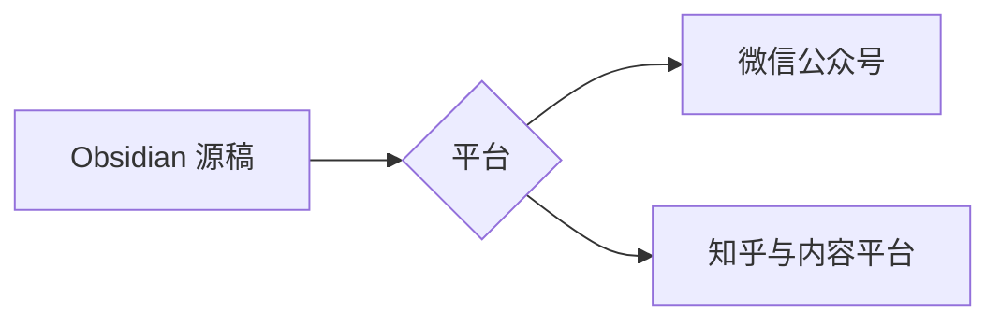

---
crosspost:
  title: Crosspost Studio 验收文章
  author: 测试作者
  summary: 包含 MVP 所需内容类型的草稿验收文章。
  cover: "[[assets/local-diagram.png]]"
  targets:
    - wechat
    - zhihu
    - juejin
---

# 中文标题与基础排版

这是一段包含 **粗体**、*斜体*、[链接](https://obsidian.md/) 和行内公式
$E=mc^2$ 的中文正文。

## 列表

- 第一项
- 第二项
  - 嵌套项

## 表格

| 平台 | 草稿更新 | 最终发布 |
| --- | --- | --- |
| 公众号 | 支持 | 人工 |
| 知乎 | 支持 | 人工 |
| 掘金 | 支持 | 人工 |

## 代码

```ts
export const answer: number = 42;
```

## 图片

本地图片：

![[assets/local-diagram.png]]

远程图片：


## 行间公式

$$
\int_0^1 x^2\,dx = \frac{1}{3}
$$

## Mermaid 流程图


